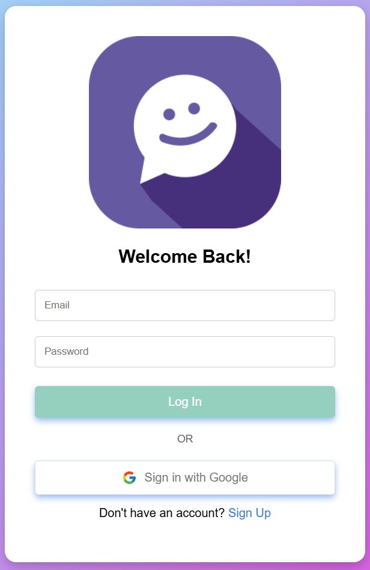
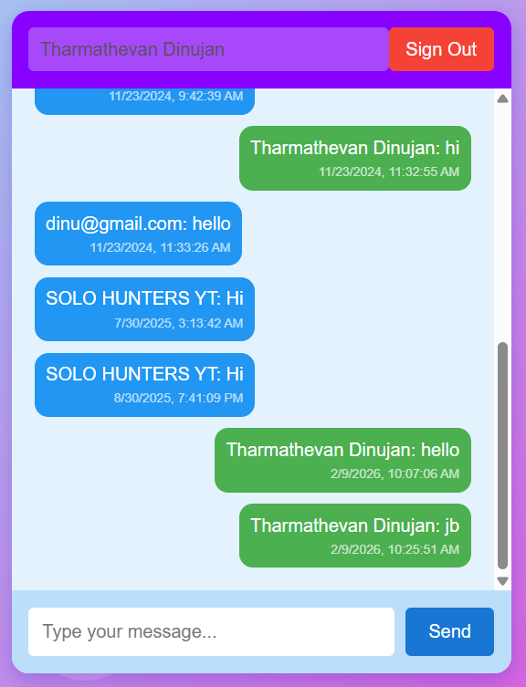

# 💬 DINU CHAT APP


A modern, real-time chat application built for performance and responsiveness. Featuring seamless authentication and instant messaging powered by **Next.js 15** and **Firebase**.

---

## ✨ Features

- **Real-time Messaging**: Instant message delivery using Firebase Realtime Database.
- **Secure Authentication**: 
  - 📧 Email/Password Login & Signup
  - 🌐 Google Sign-In Integration
- **Modern UI/UX**:
  - 🎨 Beautiful gradients & animations
  - 📱 Fully responsive design for mobile & desktop
  - ⚡ Optimized performance with Next.js App Router
- **User Experience**:
  - Auto-scroll to latest messages
  - Dynamic user status updates
  - Username display

---

## � Screenshots

| Login Page | Chat Interface |
|:---:|:---:|
|  |  |


## �🛠️ Tech Stack

- **Frontend Framework**: [Next.js 15](https://nextjs.org/) (App Router)
- **Library**: [React 19](https://react.dev/)
- **Backend / Database**: [Firebase Realtime Database](https://firebase.google.com/docs/database)
- **Authentication**: [Firebase Auth](https://firebase.google.com/docs/auth)
- **Styling**: Vanilla CSS (Global Styles + Animations)

---

## 🚀 Getting Started

Follow these steps to set up the project locally.

### Prerequisites

- Node.js 18+ installed
- A Firebase project created on the [Firebase Console](https://console.firebase.google.com/)

### Installation

1.  **Clone the repository:**
    ```bash
    git clone https://github.com/TharmathevanDinujan/Chat-app
    cd chatapp
    ```

2.  **Install dependencies:**
    ```bash
    npm install
    ```

3.  **Configure Environment Variables:**
    Create a `.env.local` file in the root directory and add your Firebase credentials:

    ```env
    NEXT_PUBLIC_FIREBASE_API_KEY=your_api_key
    NEXT_PUBLIC_FIREBASE_AUTH_DOMAIN=your_project_id.firebaseapp.com
    NEXT_PUBLIC_FIREBASE_DATABASE_URL=https://your_project_id.firebaseio.com
    NEXT_PUBLIC_FIREBASE_PROJECT_ID=your_project_id
    NEXT_PUBLIC_FIREBASE_STORAGE_BUCKET=your_project_id.appspot.com
    NEXT_PUBLIC_FIREBASE_MESSAGING_SENDER_ID=your_sender_id
    NEXT_PUBLIC_FIREBASE_APP_ID=your_app_id
    ```

4.  **Run the development server:**
    ```bash
    npm run dev
    ```

5.  Open [http://localhost:3000](http://localhost:3000) in your browser.

---

## 📦 Deployment

This project is ready for deployment on [Netlify](https://www.netlify.com/).

1.  Push your code to a Git repository (GitHub, GitLab, Bitbucket).
2.  Log in to Netlify and click **"Add new site"** > **"Import an existing project"**.
3.  Select your repository.
4.  In the **"Build & Deploy"** settings, Netlify should automatically detect Next.js.
5.  Click **"Deploy site"**.
6.  Once the site is created, go to **"Site configuration"** > **"Environment variables"** and add the variables from your `.env.local` file.
7.  Trigger a new deploy if needed! 🚀

---

## 📂 Project Structure

```bash
├── app/
│   ├── components/      # Reusable components
│   ├── login/           # Login page
│   ├── signup/          # Signup page
│   ├── globals.css      # Global styles & animations
│   ├── layout.js        # Root layout
│   └── page.js          # Chat page (Main)
├── lib/
│   └── firebase.js      # Firebase configuration
├── public/              # Static assets (images, icons)
└── ...
```

---

## 🤝 Contributing

Contributions are welcome! Please feel free to submit a Pull Request.

1.  Fork the project
2.  Create your Feature Branch (`git checkout -b feature/AmazingFeature`)
3.  Commit your Changes (`git commit -m 'Add some AmazingFeature'`)
4.  Push to the Branch (`git push origin feature/AmazingFeature`)
5.  Open a Pull Request

---

Made with ❤️ by [D_I_N_U]
